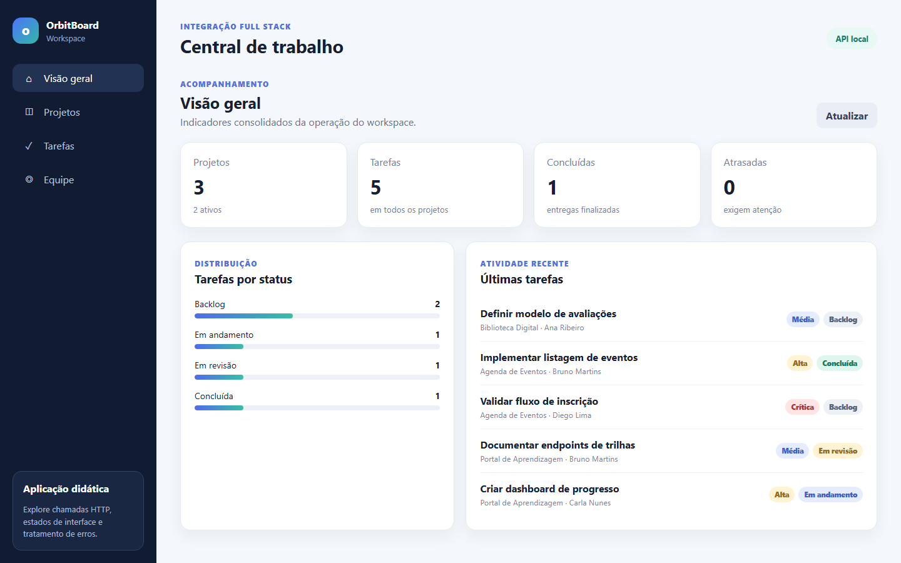
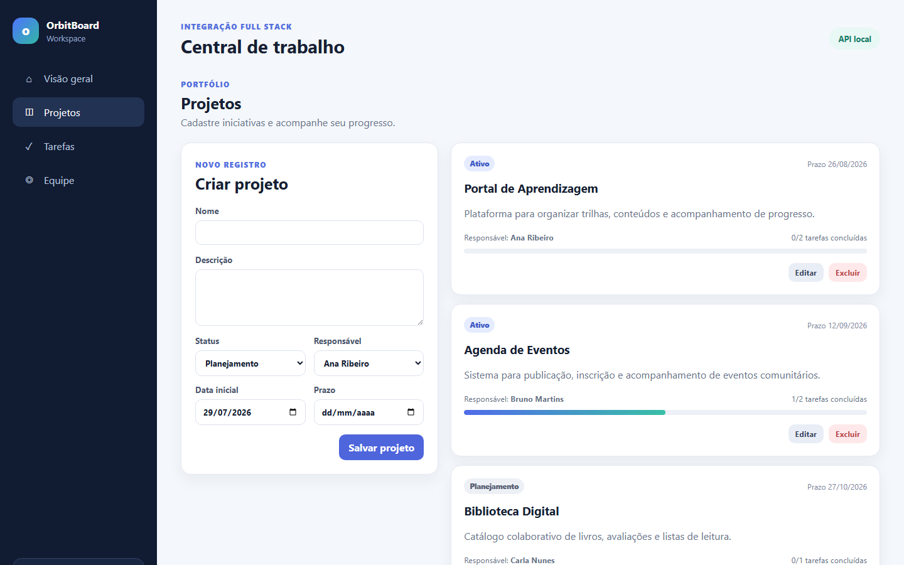
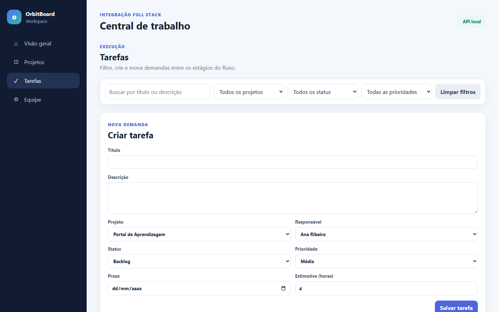
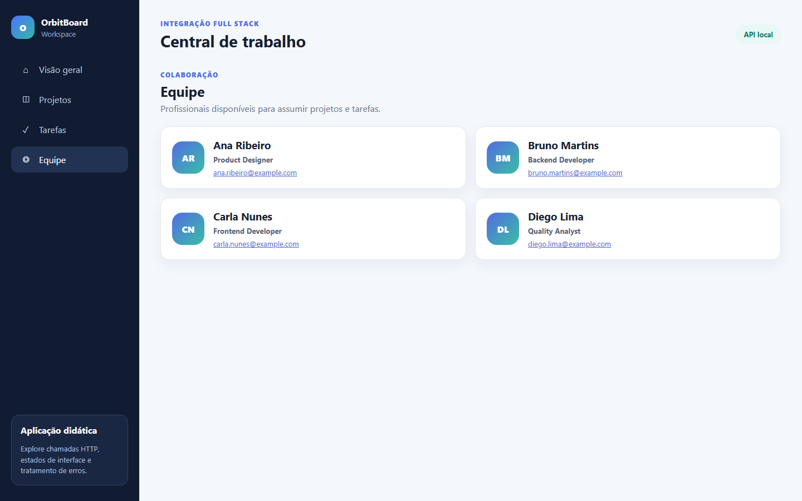
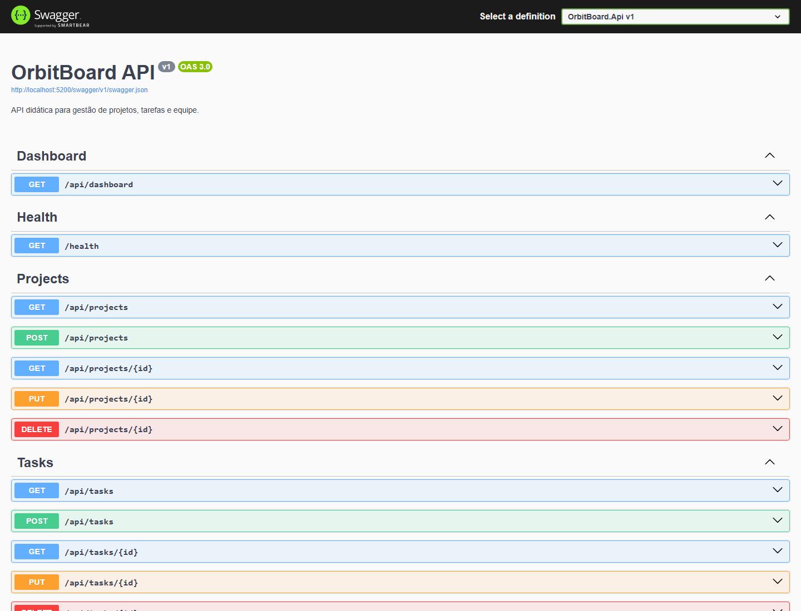
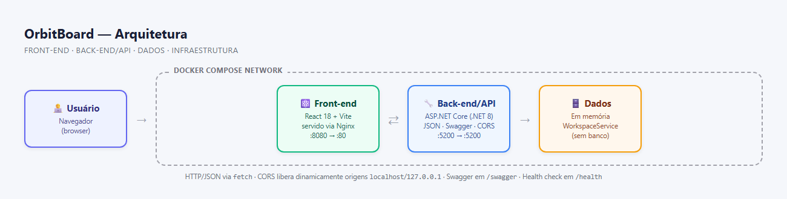
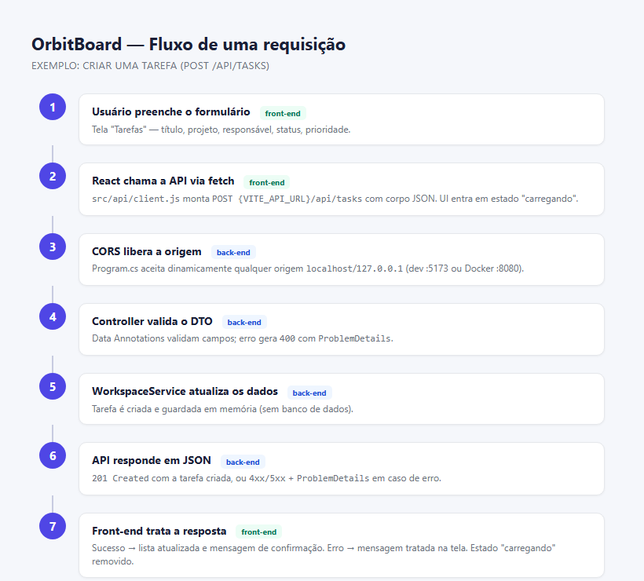
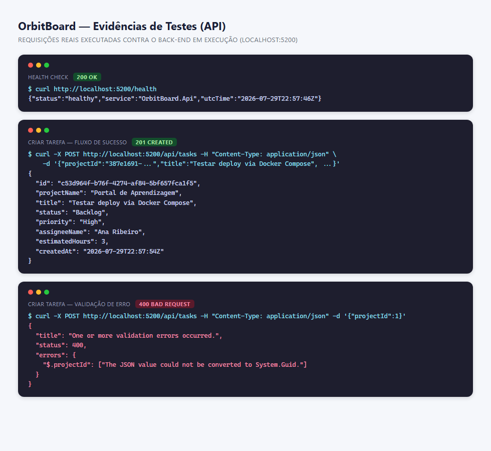

# Evidências de Testes — OrbitBoard

Testes manuais de integração realizados subindo o back-end (`dotnet run`, porta `5200`) e o
front-end (`npm run dev`, porta `5173`) e navegando pela aplicação real no navegador.

## 1. Front-end consumindo a API

### Dashboard (`GET /api/dashboard`)
Métricas e tarefas recentes carregadas em tempo real a partir da API.



### Projetos (`GET/POST /api/projects`)
Listagem de projetos vinda da API e formulário de criação.



### Tarefas (`GET/POST /api/tasks`)
Filtros (projeto, status, prioridade, busca) e formulário de criação de tarefa.



### Equipe (`GET /api/team-members`)
Lista de integrantes disponíveis para assumir projetos/tarefas.



## 2. Documentação da API (Swagger)

Swagger/OpenAPI acessível em `http://localhost:5200/swagger`, com todos os endpoints
(`Dashboard`, `Health`, `Projects`, `Tasks`, `Team Members`) documentados.



## 3. Diagramas

### Arquitetura
Usuário → front-end (React/Nginx) → back-end (.NET API) → dados em memória, todos orquestrados
via Docker Compose.



### Fluxo de uma requisição
Passo a passo de uma chamada `POST /api/tasks`, do preenchimento do formulário no front-end até
a resposta em JSON e o tratamento de sucesso/erro na tela.



## 4. Requisições reais à API (health, sucesso e erro de validação)

Capturas de `curl` reais executadas contra o back-end em execução, mostrando o fluxo de
sucesso (`201 Created`), a validação de erro (`400 Bad Request` + `ProblemDetails`) e o
health check (`200 OK`).



## 5. Erros encontrados e correções

| Problema | Causa | Correção |
|---|---|---|
| Front-end não conseguia chamar a API (bloqueio de CORS) | Código-base fornecido não tinha política de CORS configurada | Política adicionada em `Program.cs` liberando dinamicamente origens `localhost`/`127.0.0.1` em qualquer porta |
| `docker compose up` falhava | Não existiam `Dockerfile` de back-end nem de front-end | Criados os dois `Dockerfile`s (multi-stage) e o `docker-compose.yml` |

## 6. Como reproduzir

```bash
# Back-end
cd backend
dotnet run --project OrbitBoard.Api

# Front-end (outro terminal)
cd frontend
npm install
npm run dev
```

Ou via Docker Compose:

```bash
docker compose up --build
```
